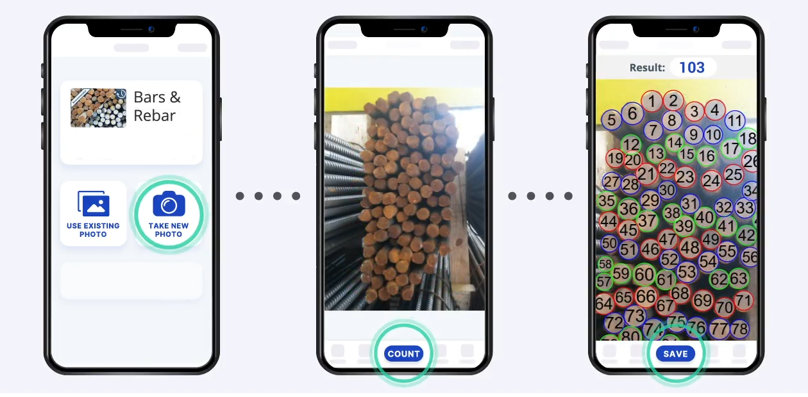

# 🧱 RebarVision – Deep Learning-Based Rebar Counting Tool



## 📌 Introduction

**RebarVision** is a deep learning-powered system to detect and count rebars (reinforcement bars) in construction site images. Using TensorFlow Lite (TFLite) and a Flutter-based mobile app, it brings real-time object detection and inventory tracking to construction professionals. Firebase is used for backend data management.

---

## 🚀 Project Overview

### 🎯 Objective
Develop an efficient and mobile-deployable machine learning model to automate rebar counting from construction site imagery, enabling faster monitoring and smarter inventory planning.

### 🛠 Tech Stack

| Component            | Technology                  |
|----------------------|-----------------------------|
| Model Training       | TensorFlow Lite Model Maker |
| Mobile Development   | Flutter                     |
| Backend Database     | Firebase                    |
| ML Deployment        | TFLite                      |

---

## 🔍 Workflow & Methodology

### 1️⃣ Data Collection
- **Sources**: On-site construction images, engineering archives, and partner organizations
- **Conditions**: Captured under varied lighting, angles, and distances to ensure robustness

### 2️⃣ Data Preprocessing
- Resized images for model compatibility
- Normalized pixel values
- Applied augmentation: rotation, flipping, brightness adjustment

### 3️⃣ Annotation
- **Tool Used**: Roboflow
- **Labels**: Bounding boxes around rebars for object detection and counting

### 4️⃣ Model Training
- **Framework**: TFLite Model Maker (MobileNet architecture)
- **Training**: Fine-tuned on annotated dataset
- **Evaluation Metrics**: Precision, Recall, F1 Score

---

## 📱 Mobile App Features

- 📷 **Capture Image**: Built-in camera functionality
- 🧠 **Detect Rebars**: On-device detection using TFLite
- 📊 **Display Results**: Count and bounding boxes shown in real-time
- ☁️ **Sync with Firebase**: Results stored and retrieved from cloud

---

## ⚙️ Setup & Installation Guide

### 🧩 Prerequisites

- Flutter SDK: [Install Guide](https://flutter.dev/docs/get-started/install)
- Visual Studio Code (with Flutter & Dart extensions)
- Android/iOS device with Developer Mode + USB Debugging enabled

### 🧪 Steps to Run

```bash
# Clone the repository
git clone https://github.com/StemEye/Rebar_Counter.git

# Navigate to the project folder
cd Rebar_Counter

# Install dependencies
flutter clean
flutter pub get
flutter upgrade

# Run on a connected device
flutter run
